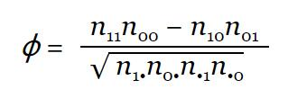

## 四、数据结构：对象和数组

> 原文：[Data Structures: Objects and Arrays](http://eloquentjavascript.net/04_data.html)
> 
> 译者：[飞龙](https://github.com/wizardforcel)
> 
> 协议：[CC BY-NC-SA 4.0](http://creativecommons.org/licenses/by-nc-sa/4.0/)
> 
> 自豪地采用[谷歌翻译](https://translate.google.cn/)
> 
> 部分参考了[《JavaScript 编程精解（第 2 版）》](https://book.douban.com/subject/26707144/)

> On two occasions I have been asked, ‘Pray, Mr. Babbage, if you put into the machine wrong figures, will the right answers come out?’ [...] I am not able rightly to apprehend the kind of confusion of ideas that could provoke such a question.
> 
> Charles Babbage，《Passages from the Life of a Philosopher》（1864）


数字，布尔和字符串是构建数据结构的原子。 不过，许多类型的信息都需要多个原子。 对象允许我们将值（包括其他对象）放到一起，来构建更复杂的结构。

我们迄今为止构建的程序，受到一个事实的限制，它们仅在简单数据类型上运行。 本章将介绍基本的数据结构。 到最后，你会知道足够多的东西，开始编写有用的程序。

本章将着手于一个或多或少的实际编程示例，当概念适用于手头问题时引入它们。 示例代码通常基于本文前面介绍的函数和绑定。

## 松鼠人

一般在晚上八点到十点之间，雅克就会变身成为一只毛茸茸的松鼠，尾巴上的毛十分浓密。

一方面，雅克非常高兴他没有变成经典的狼人。 与变成狼相比，变成松鼠的确会产生更少的问题。 他不必担心偶然吃掉邻居（那会很尴尬），而是担心被邻居的猫吃掉。 他在橡木树冠上的一个薄薄的树枝上醒来，赤身裸体并迷失方向。在这两次偶然之后，他在晚上锁上了房间的门窗，并在地板上放了几个核桃，来使自己忙起来。

这就解决了猫和树的问题。 但雅克宁愿完全摆脱他的状况。 不规律发生的变身使他怀疑，它们可能会由某种东西触发。 有一段时间，他相信只有在他靠近橡树的日子里才会发生。 但是避开橡树不能阻止这个问题。

雅克切换到了更科学的方法，开始每天记录他在某一天所做的每件事，以及他是否变身。 有了这些数据，他希望能够缩小触发变身的条件。

他需要的第一个东西，是存储这些信息的数据结构。

## 数据集

为了处理大量的数字数据，我们首先必须找到一种方法，将其在我们的机器内存中表示。 举例来说，我们想要表示一组数字 2, 3, 5, 7 和 11。

我们可以用字符串来创建 - 毕竟，字符串可以有任意长度，所以我们可以把大量数据放入它们中，并使用`"2 3 5 7 11"`作为我们的表示。 但这很笨拙。 你必须以某种方式提取数字，并将它们转换回数字才能访问它们。

幸运的是，JavaScript提供了一种数据类型，专门用于存储一系列的值。我们将这种数据类型称为数组，将一连串的值写在方括号当中，值之间使用逗号（`,`）分隔。

```js
let listOfNumbers = [2, 3, 5, 7, 11];
console.log(listOfNumbers[2]);
// → 5
console.log(listOfNumbers[0]);
// → 2
console.log(listOfNumbers[2 - 1]);
// → 3
```

我们同样使用方括号来获取数组当中的值。在表达式后紧跟一对方括号，并在方括号中填写表达式，这将会在左侧表达式里查找方括号中给定的索引所对应的值，并返回结果。

数组的第一个索引是零，而不是一。 所以第一个元素用`listOfNumbers[0]`获取。 基于零的计数在技术上有着悠久的传统，并且在某些方面意义很大，但需要一些时间来习惯。 将索引看作要跳过的项目数量，从数组的开头计数。

## 属性

在之前的章节中，我们已经看到了一些可疑的表达式，例如`myString.length`（获取字符串的长度）和`Math.max`（最大值函数）。 这些表达式可以访问某个值的属性。 在第一个中，我们访问`myString`中的`length`属性。 第二个中，我们访问`Math`对象（它是数学相关常量和函数的集合）中的名为`max`的属性。

在 JavaScript 中，几乎所有的值都有属性。但`null`和`undefined`没有。如果你尝试访问`null`和`undefined`的属性，会得到一个错误提示。

```js
null.length;
// → TypeError: null has no properties
```

在JavaScript中访问属性的两种主要方式是点（`.`）和方括号（`[]`）。 `value.x`和`value [x]`都可以访问`value`属性，但不一定是同一个属性。 区别在于如何解释`x`。 使用点时，点后面的单词是该属性的字面名称。 使用方括号时，会求解括号内的表达式来获取属性名称。 鉴于`value.x`获取`value`的名为`x`的属性，`value [x]`尝试求解表达式`x`，并将结果转换为字符串作为属性名称。

所以如果你知道你感兴趣的属性叫做`color`，那么你会写`value.color`。 如果你想提取属性由绑定`i`中保存的值命名，你可以写`value [i]`。 属性名称是字符串。 它们可以是任何字符串，但点符号仅适用于看起来像有效绑定名的名称。 所以如果你想访问名为`2`或`John Doe`的属性，你必须使用方括号：`value[2]`或`value["John Doe"]`。

数组中的元素以数组属性的形式存储，使用数字作为属性名称。 因为你不能用点号来表示数字，并且通常想要使用一个保存索引的绑定，所以你必须使用括号来表达它们。

数组的`length`属性告诉我们它有多少个元素。 这个属性名是一个有效的绑定名，我们事先知道它的名字，所以为了得到一个数组的长度，通常写`array.length`，因为它比`array["length"]`更容易编写。

## 方法

除了`length`属性之外，字符串和数组对象都包含一些持有函数值的属性。

```js
let doh = "Doh";
console.log(typeof doh.toUpperCase);
// → function
console.log(doh.toUpperCase());
// → DOH
```

每个字符串都有`toUpperCase`属性。 调用时，它将返回所有字母转换为大写字符串的副本。 另外还有`toLowerCase`。

有趣的是，虽然我们没有在调用`toUpperCase`时传递任何参数，但该函数访问了字符串`"Doh"`，即被调用的属性所属的值。我们会在第 6 章中阐述这其中的原理。

我们通常将包含函数的属性称为某个值的方法。比如说，`toUpperCase`是字符串的一个方法。

此示例演示了两种方法，可用于操作数组：

```js
let sequence = [1, 2, 3];
sequence.push(4);
sequence.push(5);
console.log(sequence);
// → [1, 2, 3, 4, 5]
console.log(sequence.pop());
// → 5
console.log(sequence);
// → [1, 2, 3, 4]
```

`push`方法将值添加到数组的末尾，而`pop`方法则相反，删除数组中的最后一个值并将其返回。

这些有点愚蠢的名字是栈的传统术语。 编程中的栈是一种数据结构，它允许你将值推入并按相反顺序再次弹出，最后添加的内容首先被移除。 这些在编程中很常见 - 你可能还记得前一章中的函数调用栈，它是同一个想法的实例。

## 对象

回到松鼠人的示例。 一组每日的日志条目可以表示为一个数组。 但是这些条目并不仅仅由一个数字或一个字符串组成 - 每个条目需要存储一系列活动和一个布尔值，表明雅克是否变成了松鼠。 理想情况下，我们希望将它们组合成一个值，然后将这些分组的值放入日志条目的数组中。

对象类型的值是任意的属性集合。 创建对象的一种方法是使用大括号作为表达式。

```js
let day1 = {
  squirrel: false,
  events: ["work", "touched tree", "pizza", "running"]
};
console.log(day1.squirrel);
// → false
console.log(day1.wolf);
// → undefined
day1.wolf = false;
console.log(day1.wolf);
// → false
```

大括号内有一列用逗号分隔的属性。 每个属性都有一个名字，后跟一个冒号和一个值。 当一个对象写为多行时，像这个例子那样，对它进行缩进有助于提高可读性。 名称不是有效绑定名称或有效数字的属性必须加引号。

```js
let descriptions = {
  work: "Went to work",
  "touched tree": "Touched a tree"
};
```

这意味着大括号在 JavaScript 中有两个含义。 在语句的开头，他们起始了一个语句块。 在任何其他位置，他们描述一个对象。 幸运的是，语句很少以花括号对象开始，因此这两者之间的不明确性并不是什么大问题。

读取一个不存在的属性就会产生`undefined`。

我们可以使用=运算符来给一个属性表达式赋值。如果该属性已经存在，那么这项操作就会替换原有的值。如果该属性不存在，则会在目标对象中新建一个属性。

简要回顾我们的绑定的触手模型 - 属性绑定也类似。 他们捕获值，但其他绑定和属性可能会持有这些相同的值。 你可以将对象想象成有任意数量触手的章鱼，每个触手上都有一个名字的纹身。

`delete`运算符切断章鱼的触手。 这是一个一元运算符，当应用于对象属性时，将从对象中删除指定的属性。 这不是一件常见的事情，但它是可能的。

```js
let anObject = {left: 1, right: 2};
console.log(anObject.left);
// → 1
delete anObject.left;
console.log(anObject.left);
// → undefined
console.log("left" in anObject);
// → false
console.log("right" in anObject);
// → true
```

当应用于字符串和对象时，二元`in`运算符会告诉你该对象是否具有名称为它的属性。 将属性设置为`undefined`，和实际删除它的区别在于，在第一种情况下，对象仍然具有属性（它只是没有有意义的值），而在第二种情况下属性不再存在，`in`会返回`false`。

为了找出对象具有的属性，可以使用`Object.keys`函数。 你给它一个对象，它返回一个字符串数组 - 对象的属性名称。

```js
console.log(Object.keys({x: 0, y: 0, z: 2}));
// → ["x", "y", "z"]
```

`Object.assign`函数可以将一个对象的所有属性复制到另一个对象中。

```js
let objectA = {a: 1, b: 2};
Object.assign(objectA, {b: 3, c: 4});
console.log(objectA);
// → {a: 1, b: 3, c: 4}
```

然后，数组只是一种对象，专门用于存储对象序列。 如果你求解`typeof []`，它会产生`object`。 你可以看到它们是长而平坦的章鱼，它们的触手整齐排列，并以数字标记。

我们将雅克的日记表示为对象数组。

```js
let journal = [
  {events: ["work", "touched tree", "pizza",
            "running", "television"],
   squirrel: false},
  {events: ["work", "ice cream", "cauliflower",
            "lasagna", "touched tree", "brushed teeth"],
   squirrel: false},
  {events: ["weekend", "cycling", "break", "peanuts",
            "beer"],
   squirrel: true},
  /* and so on... */
];
```

## 可变性

我们现在即将开始真正的编程。 首先还有一个理论要理解。

我们看到对象值可以修改。 前面几章讨论的数值类型（如数字，字符串和布尔值）都是不可变的 -- 这些类型的值不可能修改。 你可以将它们组合起来并从它们派生新的值，但是当你采用特定的字符串值时，该值将始终保持不变。 里面的文字不能改变。 如果你有一个包含`"cat"`的字符串，其他代码不可能修改你的字符串中的一个字符，来使它变成`"rat"`。

对象的工作方式不同。你可以更改其属性，使单个对象值在不同时间具有不同的内容。

当我们有两个数字，120 和 120 时，我们可以将它们看作完全相同的数字，不管它们是否指向相同的物理位。 使用对象时，拥有同一个对象的两个引用，和拥有包含相同属性的两个不同的对象，是有区别的。 考虑下面的代码：

```js
let object1 = {value: 10};
let object2 = object1;
let object3 = {value: 10};

console.log(object1 == object2);
// → true
console.log(object1 == object3);
// → false

object1.value = 15;
console.log(object2.value);
// → 15
console.log(object3.value);
// → 10
```

`object1`和`object2`绑定持有相同对象，这就是为什么改变`object1`会改变`object2`的值。 据说他们具有相同的身份。 绑定`object3`指向一个不同的对象，它最初包含的属性与`object1`相同，但过着单独的生活。

绑定可以是可变的或不变的，但这与它们的值的行为方式是分开的。 即使数值不变，你也可以使用`let`绑定来跟踪一个变化的数字，通过修改绑定所指向的值。与之类似，虽然对象的`const`绑定本身不可改变，并且始终指向相同对象，该对象的内容可能会改变。

```js
const score = {visitors: 0, home: 0};
// This is okay
score.visitors = 1;
// This isn't allowed
score = {visitors: 1, home: 1};
```

当你用 JavaScript 的`==`运算符比较对象时，它按照身份进行比较：仅当两个对象的值严格相同时才产生`true`。 比较不同的对象会返回`false`，即使它们属性相同。 JavaScript 中没有内置的“深层”比较操作，它按照内容比较对象，但可以自己编写它（这是本章末尾的一个练习）。

## 松鼠人的记录

于是，雅克开始了他的 JavaScript 之旅，并搭建了用于保存每天记录的一套开发环境。

```js
let journal = [];

function addEntry(events, squirrel) {
  journal.push({events, squirrel});
}
```

请注意添加到日记中的对象看起来有点奇怪。 它不像`events:events`那样声明属性，只是提供属性名称。 这是一个简写，意思一样 - 如果大括号中的属性名后面没有值，它的值来自相同名称的绑定。

那么，在每天晚上十点 -- 或者有时候是下一天的早晨，从它的书架顶部爬下来之后 -- 雅克记录了这一天。

```js
addEntry(["work", "touched tree", "pizza", "running",
          "television"], false);
addEntry(["work", "ice cream", "cauliflower", "lasagna",
          "touched tree", "brushed teeth"], false);
addEntry(["weekend", "cycling", "break", "peanuts",
          "beer"], true);
```

一旦他有了足够的数据点，他打算使用统计学来找出哪些事件可能与变成松鼠有关。

关联性是统计绑定之间的独立性的度量。 统计绑定与编程绑定不完全相同。 在统计学中，你通常会有一组度量，并且每个绑定都根据每个度量来测量。 绑定之间的相关性通常表示为从 -1 到 1 的值。 相关性为零意味着绑定不相关。 相关性为一表明两者完全相关 - 如果你知道一个，你也知道另一个。 负一意味着它们是完全相关的，但它们是相反的 - 当一个是真的时，另一个是假的。


为了计算两个布尔绑定之间的相关性度量，我们可以使用 phi 系数（`ϕ`）。 这是一个公式，输入为一个频率表格，包含观测绑定的不同组合的次数。 公式的输出是 -1 和 1 之间的数字。

我们可以将吃比萨的事件放在这样的频率表中，每个数字表示我们的度量中的组合的出现次数。


如果我们将那个表格称为`n`，我们可以用下列公式自己算`ϕ`：



（如果你现在把这本书放下，专注于十年级数学课的可怕的再现，坚持住！我不打算用无休止的神秘符号折磨你 - 现在只有这一个公式。我们所做的就是把它变成 JavaScript。）

符号`n01`表明， 第一个绑定（松鼠）为假（0）时，第二个绑定（披萨）为真（1）。 在披萨表中，`n01`是 9。

值`n1`表示所有度量之和，其中第一个绑定为`true`，在示例表中为 5。 同样，`n0`表示所有度量之和，其中第二个绑定为假。

因此，我们以比萨表为例，除法线上方的部分（被除数）为`1×76–9×4=40`，而除法线下面的部分（除数）则是`10×80×5×85`的平方根，也就是`√340000`。计算结果为`ϕ≈0.069`，这个结果很小，因此吃比萨对是否变身成松鼠显然没有太大影响。

## 计算关联性

我们可以用包含 4 个元素的数组（`[76，9，4，1]`）来表示一张 2 乘 2 的表格。我们也可以使用其他表示方式，比如包含两个数组的数组，每个子数组又包含两个元素（`[[76，9]，[4，1]]`）。也可以使用一个对象，它包含一些属性，名为`"11"`和`"01"`。但是，一维数组更为简单，也容易进行操作。我们可以将数组索引看成包含两个二进制位的数字，左边的（高位）数字表示绑定“是否变成松鼠”，右边的（低位）数字表示事件绑定。例如，若二进制数字为 10，表示雅克变成了松鼠，但事件并未发生（比如说吃比萨）。这种情况发生了 4 次。由于二进制数字 10 的十进制是 2，因此我们将其存储到数组中索引为 2 的位置上。

下面这个函数用于计算数组的系数`ϕ`：

```js
function phi(table) {
  return (table[3] * table[0] - table[2] * table[1]) /
    Math.sqrt((table[2] + table[3]) *
              (table[0] + table[1]) *
              (table[1] + table[3]) *
              (table[0] + table[2]));
}

console.log(phi([76, 9, 4, 1]));
// → 0.068599434
```

这将`ϕ`公式直接翻译成 JavaScript。 `Math.sqrt`是平方根函数，由标准 JavaScript 环境中的`Math`对象提供。 我们必须在表格中添加两个字段来获取字段，例如`n1`因为行和或者列和不直接存储在我们的数据结构中。

雅克花了三个月的时间记录日志。在本章的代码沙箱（[http://eloquentjavascript.net/code/](http://eloquentjavascript.net/code/)）的下载文件中，用`JOURNAL`绑定存储了该结果数据集合。

若要从这篇记录中提取出某个特定事件的 2 乘 2 表格，我们首先需要循环遍历整个记录，并计算出与变身成松鼠相关事件发生的次数。

```js
function hasEvent(event, entry) {
  return entry.events.indexOf(event) != -1;
}

function tableFor(event, journal) {
  let table = [0, 0, 0, 0];
  for (let i = 0; i < journal.length; i++) {
    let entry = journal[i], index = 0;
    if (entry.events.includes(event)) index += 1;
    if (entry.squirrel) index += 2;
    table[index] += 1;
  }
  return table;
}

console.log(tableFor("pizza", JOURNAL));
// → [76, 9, 4, 1]
```

数组拥有`includes`方法，检查给定值是否存在于数组中。 该函数使用它来确定，对于某一天，感兴趣的事件名称是否在事件列表中。

`tableFor`中的循环体通过检查列表是否包含它感兴趣的特定事件，以及该事件是否与松鼠事件一起发生，来计算每个日记条目在表格中的哪个盒子。 然后循环对表中的正确盒子加一。

我们现在有了我们计算个体相关性的所需工具。 剩下的唯一一步，就是为记录的每种类型的事件找到关联，看看是否有什么明显之处。

## 数组循环

在`tableFor`函数中，有一个这样的循环：

```js
for (let i = 0; i < JOURNAL.length; i++) {
  let entry = JOURNAL[i];
  // Do something with entry
}
```

这种循环在经典的 JavaScript 中很常见 - 遍历数组，一次一个元素会很常见，为此，你需要在数组长度上维护一个计数器，并依次选取每个元素。

在现代 JavaScript 中有一个更简单的方法来编写这样的循环。

```js
for (let entry of JOURNAL) {
  console.log(`${entry.events.length} events.`);
}
```

当`for`循环看起来像这样，在绑定定义之后用`of`这个词时，它会遍历`of`之后的给定值的元素。 这不仅适用于数组，而且适用于字符串和其他数据结构。 我们将在第 6 章中讨论它的工作原理。

## 分析结果

我们需要计算数据集中发生的每种类型事件的相关性。 为此，我们首先需要寻找每种类型的事件。

```js
function journalEvents(journal) {
  let events = [];
  for (let entry of journal) {
    for (let event of entry.events) {
      if (!events.includes(event)) {
        events.push(event);
      }
    }
  }
  return events;
}

console.log(journalEvents(JOURNAL));
// → ["carrot", "exercise", "weekend", "bread", …]
```

通过遍历所有事件，并将那些不在里面的事件添加到`events`数组中，该函数收集每种事件。

使用它，我们可以看到所有的相关性。

```js
for (let event of journalEvents(JOURNAL)) {
  console.log(event + ":", phi(tableFor(event, JOURNAL)));
}
// → carrot:   0.0140970969
// → exercise: 0.0685994341
// → weekend:  0.1371988681
// → bread:   -0.0757554019
// → pudding: -0.0648203724
// and so on...
```

绝大多数相关系数都趋近于 0。显然，摄入胡萝卜、面包或布丁并不会导致变身成松鼠。但是似乎在周末变身成松鼠的概率更高。让我们过滤结果，来仅仅显示大于 0.1 或小于 -0.1 的相关性。

```js
for (let event of journalEvents(JOURNAL)) {
  let correlation = phi(tableFor(event, JOURNAL));
  if (correlation > 0.1 || correlation < -0.1) {
    console.log(event + ":", correlation);
  }
}
// → weekend:        0.1371988681
// → brushed teeth: -0.3805211953
// → candy:          0.1296407447
// → work:          -0.1371988681
// → spaghetti:      0.2425356250
// → reading:        0.1106828054
// → peanuts:        0.5902679812
```

啊哈！这里有两个因素，其相关性明显强于其他因素。 吃花生对变成松鼠的几率有强烈的积极影响，而刷牙有显着的负面影响。

这太有意思了。让我们再仔细看看这些数据。

```js
for (let entry of JOURNAL) {
  if (entry.events.includes("peanuts") &&
     !entry.events.includes("brushed teeth")) {
     entry.events.push("peanut teeth");
  }
}
console.log(phi(tableFor("peanut teeth", JOURNAL)));
// → 1
```

这是一个强有力的结果。 这种现象正好发生在雅克吃花生并且没有刷牙时。 如果他只是不注意口腔卫生，他从来没有注意到他的病痛。

知道这些之后，雅克完全停止吃花生，发现他的变身消失了。

几年来，雅克过得越来越好。 但是在某个时候他失去了工作。 因为他生活在一个糟糕的国家，没有工作就意味着没有医疗服务，所以他被迫在一个马戏团就业，在那里他扮演的是不可思议的松鼠人，在每场演出前都用花生酱塞满了它的嘴。

## 数组详解

在完成本章之前，我想向你介绍几个对象相关的概念。 我将首先介绍一些通常实用的数组方法。

我们在本章的前面已经了解了`push`和`pop`方法，分别用于在数组末尾添加或删除元素。相应地，在数组的开头添加或删除元素的方法分别是`unshift`和`shift`。

```js
let todoList = [];
function remember(task) {
  todoList.push(task);
}
function getTask() {
  return todoList.shift();
}
function rememberUrgently(task) {
  todoList.unshift(task);
}
```

这个程序管理任务队列。 你通过调用`remember("groceries")`，将任务添加到队列的末尾，并且当你准备好执行某些操作时，可以调用`getTask()`从队列中获取（并删除）第一个项目。 `rememberUrgently`函数也添加任务，但将其添加到队列的前面而不是队列的后面。

有一个与`indexOf`方法类似的方法，叫`lastIndexOf`，只不过`indexOf`从数组第一个元素向后搜索，而`lastIndexOf`从最后一个元素向前搜索。

```js
console.log([1, 2, 3, 2, 1].indexOf(2));
// → 1
console.log([1, 2, 3, 2, 1].lastIndexOf(2));
// → 3
```

`indexOf`和`lastIndexOf`方法都有一个可选参数，可以用来指定搜索的起始位置。

另一个基本方法是`slice`，该方法接受一个起始索引和一个结束索引，然后返回数组中两个索引范围内的元素。起始索引元素包含在返回结果中，但结束索引元素不会包含在返回结果中。

```js
console.log([0, 1, 2, 3, 4].slice(2, 4));
// → [2, 3]
console.log([0, 1, 2, 3, 4].slice(2));
// → [2, 3, 4]
```

如果没有指定结束索引，`slice`会返回从起始位置之后的所有元素。你也可以省略起始索引来复制整个数组。

`concat`方法可用于将数组粘在一起，来创建一个新数组，类似于`+`运算符对字符串所做的操作。

以下示例展示了`concat`和`slice`的作用。 它接受一个数组和一个索引，然后它返回一个新数组，该数组是原数组的副本，并且删除了给定索引处的元素：

```js
function remove(array, index) {
  return array.slice(0, index)
    .concat(array.slice(index + 1));
}
console.log(remove(["a", "b", "c", "d", "e"], 2));
// → ["a", "b", "d", "e"]
```

如果你将`concat`传递给一个不是数组的参数，该值将被添加到新数组中，就像它是单个元素的数组一样。

## 字符串及其属性

我们可以调用字符串的`length`或`toUpperCase`这样的属性，但不能向字符串中添加任何新的属性。

```js
let kim = "Kim";
kim.age = 88;
console.log(kim.age);
// → undefined
```

字符串、数字和布尔类型的值并不是对象，因此当你向这些值中添加属性时 JavaScript 并不会报错，但实际上你并没有将这些属性添加进去。前面说过，这些值是不变的，不能改变。

但这些类型包含一些内置属性。每个字符串中包含了若干方法供我们使用，最有用的方法可能就是`slice`和`indexOf`了，它们的功能与数组中的同名方法类似。

```js
console.log("coconuts".slice(4, 7));
// → nut
console.log("coconut".indexOf("u"));
// → 5
```

一个区别是，字符串的`indexOf`可以搜索包含多个字符的字符串，而相应的数组方法仅查找单个元素。

```js
console.log("one two three".indexOf("ee"));
// → 11
```

`trim`方法用于删除字符串中开头和结尾的空白符号（空格、换行符和制表符等符号）。

```js
console.log("  okay \n ".trim());
// → okay
```

上一章中的`zeroPad`函数也作为方法存在。 它被称为`padStart`，接受所需的长度和填充字符作为参数。

```js
console.log(String(6).padStart(3, "0"));
// → 006
```

你可以使用`split`，在另一个字符串的每个出现位置分割一个字符串，然后再用`join`把它连接在一起。

```js
let sentence = "Secretarybirds specialize in stomping";
let words = sentence.split(" ");
console.log(words);
// → ["Secretarybirds", "specialize", "in", "stomping"]
console.log(words.join(". "));
// → Secretarybirds. specialize. in. stomping
```

可以用`repeat`方法重复一个字符串，该方法创建一个新字符串，包含原始字符串的多个副本，并将其粘在一起。

```js
console.log("LA".repeat(3));
// → LALALA
```

我们已经看到了字符串类型的`length`属性。 访问字符串中的单个字符，看起来像访问数组元素（有一个警告，我们将在第 5 章中讨论）。

```js
let string = "abc";
console.log(string.length);
// → 3
console.log(string[1]);
// → b
```

## 剩余参数

一个函数可以接受任意数量的参数。 例如，`Math.max`计算提供给它的参数的最大值。

为了编写这样一个函数，你需要在函数的最后一个参数之前放三个点，如下所示：

```js
function max(...numbers) {
  let result = -Infinity;
  for (let number of numbers) {
    if (number > result) result = number;
  }
  return result;
}
console.log(max(4, 1, 9, -2));
// → 9
```

当这样的函数被调用时，剩余参数绑定一个数组，包含所有其它参数。 如果之前有其他参数，它们的值不是该数组的一部分。 当它是唯一的参数时，如`max`中那样，它将保存所有参数。

你可以使用类似的三点表示法，来使用参数数组调用函数。

```js
let numbers = [5, 1, 7];
console.log(max(...numbers));
// → 7
```

这在函数调用中“展开”数组，并将其元素传递为单独的参数。 像`max(9, ...numbers, 2)'那样，可以包含像这样的数组以及其他参数。

方括号的数组表示法，同样允许三点运算符将另一个数组展开到新数组中：

```js
let words = ["never", "fully"];
console.log(["will", ...words, "understand"]);
// → ["will", "never", "fully", "understand"]
```

## Math对象

正如我们所看到的那样，`Math`对象中包含了许多与数字相关的工具函数，比如`Math.max`（求最大值）、`Math.min`（求最小值）和`Math.sqrt`（求平方根）。

`Math`对象被用作一个容器来分组一堆相关的功能。 只有一个`Math`对象，它作为一个值几乎没有用处。 相反，它提供了一个命名空间，使所有这些函数和值不必是全局绑定。

过多的全局绑定会“污染”命名空间。全局绑定越多，就越有可能一不小心把某些绑定的值覆盖掉。比如，我们可能想在程序中使用名为`max`的绑定，由于 JavaScript 将内置的`max`函数安全地放置在`Math`对象中，因此不必担心`max`的值会被覆盖。

当你去定义一个已经被使用的绑定名的时候，对于很多编程语言来说，都会阻止你这么做，至少会对这种行为发出警告。但是 JavaScript 不会，因此要小心这些陷阱。

让我们来继续了解`Math`对象。如果需要做三角运算，`Math`对象可以帮助到你，它包含`cos`（余弦）、`sin`（正弦）、`tan`（正切）和各自的反函数（`acos`、`asin`和`atan`）。`Math.PI`则表示数字`π`，或至少是 JavaScript 中的数字近似值。在传统的程序设计当中，常量均以大写来标注。

```js
function randomPointOnCircle(radius) {
  let angle = Math.random() * 2 * Math.PI;
  return {x: radius * Math.cos(angle),
          y: radius * Math.sin(angle)};
}
console.log(randomPointOnCircle(2));
// → {x: 0.3667, y: 1.966}
```

如果你对正弦或余弦不大熟悉，不必担心。我们会在第 13 章用到它们时，再做进一步解释。

在上面的示例代码中使用了`Math.random`。每次调用该函数时，会返回一个伪随机数，范围在 0（包括）到 1（不包括）之间。

```js
console.log(Math.random());
// → 0.36993729369714856
console.log(Math.random());
// → 0.727367032552138
console.log(Math.random());
// → 0.40180766698904335
```

虽然计算机是确定性的机器，但如果给定相同的输入，它们总是以相同的方式作出反应 - 让它们产生随机显示的数字是可能的。 为此，机器会维护一些隐藏的值，并且每当你请求一个新的随机数时，它都会对该隐藏值执行复杂的计算来创建一个新值。 它存储一个新值并返回从中派生的一些数字。 这样，它可以以随机的方式产生新的，难以预测的数字。

如果我们想获取一个随机的整数而非小数，可以使用`Math.floor`（向下取整到与当前数字最接近的整数）来处理`Math.random`的结果。

```js
console.log(Math.floor(Math.random() * 10));
// → 2
```

将随机数乘以 10 可以得到一个在 0 到 10 之间的数字。由于`Math.floor`是向下取整，因此该函数会等概率地取到 0 到 9 中的任何一个数字。

还有两个函数，分别是`Math.ceil`（向上取整）和`Math.round`（四舍五入）。以及`Math.abs`，它取数字的绝对值，这意味着它反转了负值，但保留了正值。

## 解构

让我们暂时回顾`phi`函数：

```js
function phi(table) {
  return (table[3] * table[0] - table[2] * table[1]) /
    Math.sqrt((table[2] + table[3]) *
              (table[0] + table[1]) *
              (table[1] + table[3]) *
              (table[0] + table[2]));
}
```

这个函数难以阅读的原因之一，是我们有一个指向数组的绑定，但我们更愿意拥有数组的元素的绑定，即`let n00 = table [0]`以及其他。 幸运的是，有一种简洁的方法可以在 JavaScript 中执行此操作。

```js
function phi([n00, n01, n10, n11]) {
  return (n11 * n00 - n10 * n01) /
    Math.sqrt((n10 + n11) * (n00 + n01) *
              (n01 + n11) * (n00 + n10));
}
```

这也适用于由`let`，`var`或`const`创建的绑定。 如果你知道要绑定的值是一个数组，则可以使用方括号来“向内查看”该值，并绑定其内容。

类似的技巧适用于对象，使用大括号代替方括号。

```js
let {name} = {name: "Faraji", age: 23};
console.log(name);
// → Faraji
```

请注意，如果尝试解构`null`或`undefined`，则会出现错误，就像直接尝试访问这些值的属性一样。

## JSON

因为属性只是捕获了它们的值，而不是包含它们，对象和数组在计算机的内存中储存为字节序列，存放它们的内容的地址（内存中的位置）。 因此，包含另一个数组的数组，（至少）由两个内存区域组成，一个用于内部数组，另一个用于外部数组，（除了其它东西之外）其中包含表示内部数组位置的二进制数。

如果你想稍后将数据保存到文件中，或者通过网络将其发送到另一台计算机，则必须以某种方式，将这些混乱的内存地址转换为可以存储或发送的描述。 我想你可以把你的整个计算机内存，连同你感兴趣的值的地址一起发送，但这似乎并不是最好的方法。

我们可以做的是序列化数据。 这意味着它被转换为扁平的描述。 流行的序列化格式称为  JSON（发音为“Jason”），它代表 JavaScript Object Notation（JavaScript 对象表示法）。 它被广泛用作 Web 上的数据存储和通信格式，即使在 JavaScript 以外的语言中也是如此。

JSON 看起来像 JavaScript 的数组和对象的表示方式，但有一些限制。 所有属性名都必须用双引号括起来，并且只允许使用简单的数据表达式 - 没有函数调用，绑定或任何涉及实际计算的内容。 JSON 中不允许注释。

表示为 JSON 数据时，日记条目可能看起来像这样

```json
{
  "squirrel": false,
  "events": ["work", "touched tree", "pizza", "running"]
}
```

JavaScript 为我们提供了函数`JSON.stringify`和`JSON.parse`，来将数据转换为这种格式，以及从这种格式转换。 第一个函数接受 JavaScript 值并返回 JSON 编码的字符串。 第二个函数接受这样的字符串并将其转换为它编码的值。

```js
let string = JSON.stringify({squirrel: false,
                             events: ["weekend"]});
console.log(string);
// → {"squirrel":false,"events":["weekend"]}
console.log(JSON.parse(string).events);
// → ["weekend"]
```

## 本章小结

对象和数组（一种特殊对象）可以将几个值组合起来形成一个新的值。理论上说，我们可以将一组相关的元素打包成一个对象，并通过这个对象来访问这些元素，以避免管理那些支离破碎的元素。

在 JavaScript 中，除了`null`和`undefined`以外，绝大多数的值都含有属性。我们可以用`value.prop`或`value["prop"]`来访问属性。对象使用名称来定义和存储一定数量的属性。另外，数组中通常会包含不同数量的值，并使用数字（从 0 开始）作为这些值的属性。

在数组中有一些具名属性，比如`length`和一些方法。方法是作为属性存在的函数，常常作用于其所属的值。

你可以使用特殊类型的`for`循环`for (let element of array)`来迭代数组。

## 习题

### 范围的和

在本书的前言中，提到过一种很好的计算固定范围内数字之和的方法：

```js
console.log(sum(range(1, 10)));
```

编写一个`range`函数，接受两个参数：`start`和`end`，然后返回包含`start`到`end`（包括`end`）之间的所有数字。

接着，编写一个`sum`函数，接受一个数字数组，并返回所有数字之和。运行示例程序，检查一下结果是不是 55。

附加题是修改`range`函数，接受第 3 个可选参数，指定构建数组时的步长（`step`）。如果没有指定步长，构建数组时，每步增长 1，和旧函数行为一致。调用函数`range(1, 10, 2)`，应该返回`[1, 3, 5, 7, 9]`。另外确保步数值为负数时也可以正常工作，因此`range(5, 2, -1)`应该产生`[5, 4, 3, 2]`。

```js
// Your code here.

console.log(range(1, 10));
// → [1, 2, 3, 4, 5, 6, 7, 8, 9, 10]
console.log(range(5, 2, -1));
// → [5, 4, 3, 2]
console.log(sum(range(1, 10)));
// → 55
```

### 逆转数组

数组有一个`reverse`方法，它可以逆转数组中元素的次序。在本题中，编写两个函数，`reverseArray`和`reverseArrayInPlace`。第一个函数`reverseArray`接受一个数组作为参数，返回一个新数组，并逆转新数组中的元素次序。第二个函数`reverseArrayInPlace`与第一个函数的功能相同，但是直接将数组作为参数进行修改来，逆转数组中的元素次序。两者都不能使用标准的`reverse`方法。

回想一下，在上一章中关于副作用和纯函数的讨论，哪个函数的写法的应用场景更广？哪个执行得更快？

```js
// Your code here.

console.log(reverseArray(["A", "B", "C"]));
// → ["C", "B", "A"];
let arrayValue = [1, 2, 3, 4, 5];
reverseArrayInPlace(arrayValue);
console.log(arrayValue);
// → [5, 4, 3, 2, 1]
```

### 实现列表

对象作为一个值的容器，它可以用来构建各种各样的数据结构。有一种通用的数据结构叫作列表（list）（不要与数组混淆）。列表是一种嵌套对象集合，第一个对象拥有第二个对象的引用，而第二个对象有第三个对象的引用，依此类推。

```js
let list = {
  value: 1,
  rest: {
    value: 2,
    rest: {
      value: 3,
      rest: null
    }
  }
};
```

最后产生的对象形成了一条链，如下图所示：


使用列表的一个好处是，它们之间可以共享相同的子列表。举个例子，如果我们新建了两个值：`{value: 0，result: list}`和`{value: -1，result: list`}（`list`引用了我们前面定义的绑定）。这是两个独立的列表，但它们之间却共享了同一个数据结构，该数据结构包含列表末尾的三个元素。而且我们前面定义的`list`仍然是包含三个元素的列表。

编写一个函数`arrayToList`，当给定参数`[1, 2, 3]`时，建立一个和示例相似的数据结构。然后编写一个`listToArray`函数，将列表转换成数组。再编写一个工具函数`prepend`，接受一个元素和一个列表，然后创建一个新的列表，将元素添加到输入列表的开头。最后编写一个函数`nth`，接受一个列表和一个数，并返回列表中指定位置的元素，如果该元素不存在则返回`undefined`。

如果你觉得这都不是什么难题，那么编写一个递归版本的`nth`函数。

```js
// Your code here.

console.log(arrayToList([10, 20]));
// → {value: 10, rest: {value: 20, rest: null}}
console.log(listToArray(arrayToList([10, 20, 30])));
// → [10, 20, 30]
console.log(prepend(10, prepend(20, null)));
// → {value: 10, rest: {value: 20, rest: null}}
console.log(nth(arrayToList([10, 20, 30]), 1));
// → 20
```

### 深层比较

`==`运算符可以判断对象是否相等。但有些时候，你希望比较的是对象中实际属性的值。

编写一个函数`deepEqual`，接受两个参数，若两个对象是同一个值或两个对象中有相同属性，且使用`deepEqual`比较属性值均返回`true`时，返回`true`。

为了弄清楚通过身份（使用`===`运算符）还是其属性比较两个值，可以使用`typeof`运算符。如果对两个值使用`typeof`均返回`"object"`，则说明你应该进行深层比较。但需要考虑一个例外的情况：由于历史原因，`typeof null`也会返回`"object"`。

当你需要查看对象的属性来进行比较时，`Object.keys`函数将非常有用。

```js
// Your code here.

let obj = {here: {is: "an"}, object: 2};
console.log(deepEqual(obj, obj));
// → true
console.log(deepEqual(obj, {here: 1, object: 2}));
// → false
console.log(deepEqual(obj, {here: {is: "an"}, object: 2}));
// → true
```
